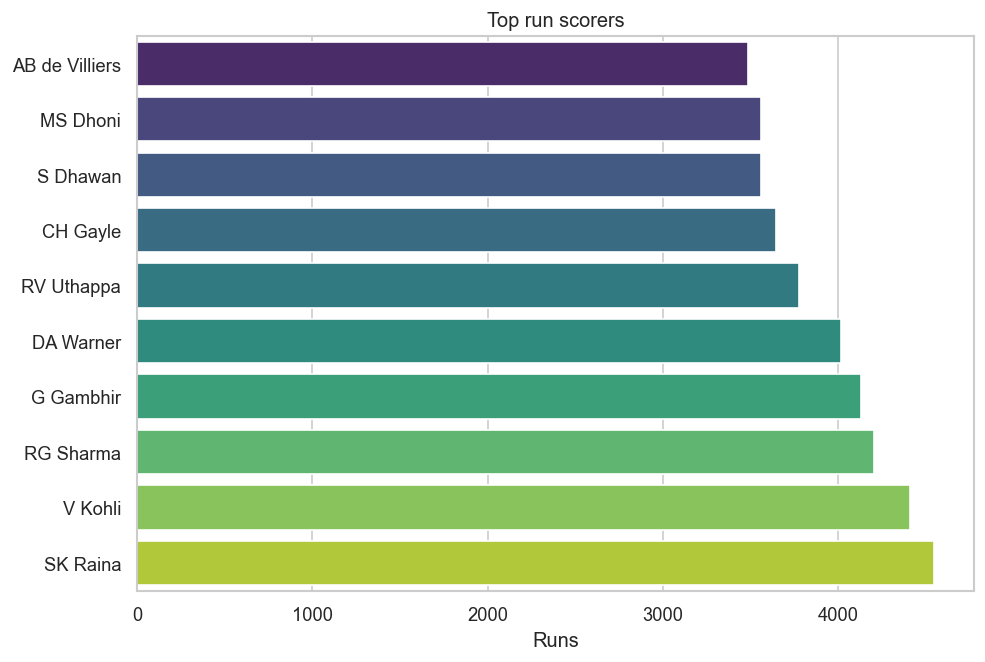

# IPL Data Analysis Pipeline

An end-to-end **PySpark** data pipeline over the Indian Premier League (IPL)
dataset (seasons **2008–2017**). It ingests raw CSVs, validates them, cleans and
conforms them into typed Parquet, models an analytics **star schema**, and
produces analysis charts.

```
raw CSV ──► ingest ──► validate ──► transform ──► star schema ──► analyse ──► charts
            (explore)  (pydantic)   (silver)      (gold)          (pandas)    (PNG + notebook)
```

## Results preview

Top run scorers across 2008–2017 (one of 11 generated charts in [`reports/`](reports/)):



## Architecture

The pipeline is a series of stages, each a module under [`src/`](src/). Every
stage reuses a shared Spark session and structured logging.

| Stage | Module | What it does |
|-------|--------|--------------|
| Ingest | [`ingestion.py`](src/ingestion.py) | Load the 5 raw CSVs and print exploratory diagnostics (shape, dtypes, sample rows, missing values). |
| Validate | [`validation.py`](src/validation.py) | Row-level validation with **pydantic** models (collect-and-report; never blocks). |
| Transform | [`transform.py`](src/transform.py) | Clean & conform to typed "silver" Parquet: cast dates, reconcile team id/name mismatches, drop sentinel rows/all-null columns, `try_cast` under Spark ANSI mode. |
| Star schema | [`star_schema.py`](src/star_schema.py) | Build the "gold" dimensional model: `dim_team`, `dim_player`, `dim_match`, `dim_date`, and `fact_deliveries` (one row per ball). |
| Analyse | [`analysis.py`](src/analysis.py) | Aggregate queries over the star schema (team, batting, bowling, season/venue). |
| Visualise | [`visualize.py`](src/visualize.py) | Render each analysis as a chart into [`reports/`](reports/). |
| I/O | [`load.py`](src/load.py) | Parquet read/write via pandas/pyarrow. |
| Orchestrate | [`pipeline.py`](src/pipeline.py) | Run every stage end to end. |

Data layers:

- `data/raw/` — source CSVs (tracked in the repo).
- `data/processed/` — cleaned "silver" Parquet (generated; gitignored).
- `data/processed/gold/` — star-schema "gold" Parquet (generated; gitignored).

## Star schema

`fact_deliveries` (150,451 rows, grain = one delivery) references four
dimensions by their source business keys:

```
                 dim_date
                    │
  dim_team ── fact_deliveries ── dim_match
                    │
                dim_player
```

## Requirements

This project has a **strict runtime** because of PySpark/Windows constraints
worked out during development:

- **Python** 3.11+ (developed on Anaconda)
- **PySpark 3.5.3** — pinned; Spark 4.x hits a Hadoop-native-IO write issue on Windows.
- **JDK 17** — Spark 3.5 does **not** run on JDK 21+ (`Subject.getSubject` was removed). Set `JAVA_HOME` to a JDK 17 install.
- On **Windows**, Spark needs `winutils.exe`/`hadoop.dll` with `HADOOP_HOME` set. Parquet is written via pandas/pyarrow to sidestep native-IO issues.

Python dependencies are in [`requirements.txt`](requirements.txt):

```bash
pip install -r requirements.txt
```

## Usage

Run the whole pipeline from a terminal where `JAVA_HOME` points at JDK 17:

```bash
cd src
python pipeline.py
```

This writes the silver + gold Parquet and 11 charts to `reports/`.

Individual stages can also be run on their own, e.g.:

```bash
python ingestion.py     # explore the raw data
python transform.py     # clean -> silver Parquet
python star_schema.py   # build the gold star schema
python visualize.py     # analysis charts (needs gold Parquet)
```

## Analysis

Explore interactively in [`notebooks/ipl_analysis.ipynb`](notebooks/ipl_analysis.ipynb),
which reuses the same `analysis.py` functions and renders charts inline. The
four themes covered:

- **Team performance** — wins per team/season, toss-vs-win correlation.
- **Batting** — top run scorers, strike rates, boundary counts.
- **Bowling** — top wicket takers, economy rates, dismissal-type mix.
- **Season / venue** — runs per season, top scoring venues, powerplay run share.

## Project layout

```
ipl-data-analysis-practice/
├── data/raw/               # source CSVs (tracked)
├── notebooks/
│   └── ipl_analysis.ipynb  # interactive analysis
├── reports/                # generated charts (11 PNGs)
├── src/                    # pipeline modules
└── requirements.txt
```
